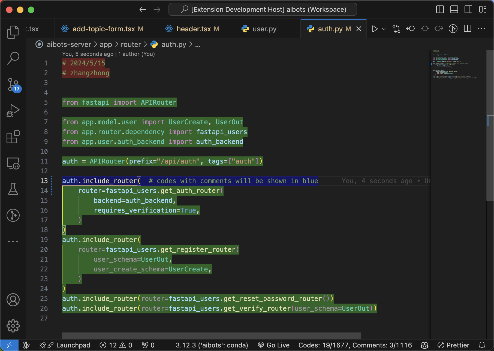

# Code Count

Inspired by linux cli tool wc, instead couting word, this tool will count lines of code for you.

## Features

* Count lines of code in current file

* Toggle the backgournd color in the editor by clicking the status bar item, which is useful when you think this tool maybe wrong, you could look at the class of each line directly. If you have seen any thing wired, please propose an [issue](https://github.com/im-zhong/code-count/issues) and let me know.
  * comments are shown in red,
  * codes are shown in green,
  * and if one line contains both code and comment, it will be shown in blue.

## TODO

* [ ] add support for c/c++
* [ ] add support for golang
* [ ] add support for rust
* [ ] add a command that statistics the whole workspace

## Requirements

## Extension Settings

## Known Issues

## Release Notes

### 0.1.0

Initial release of code count tool, support

* typescript
* javascript
* TSX
* JSX
* python

### 0.1.2

fix a bug that could stuck the extension when analyzing comment string in python

---

**Enjoy!**
