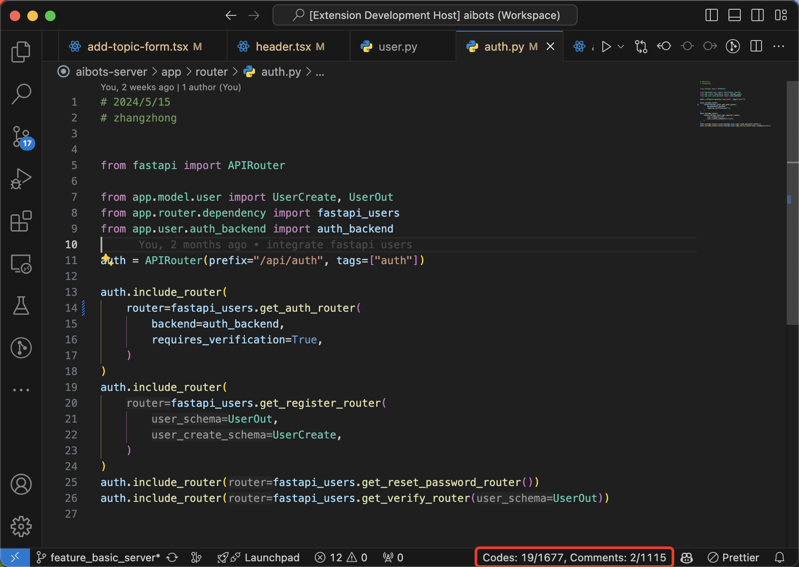

# Code Counter

Inspired by linux cli tool **wc**, instead of counting words, this tool will **lazily** counting **all your codes** in your workspaces by lines while following your **.gitignore**!

## Features

* This extension activates lazily as you interact with any files in supported languages:
  * c/c++
  * python
  * ts/js/tsx/jsx
* It displays the count of code lines and comments of current active file directly in the status bar.
* Additionally, it aggregates and shows the total line count for all files within the current workspace that match the language of the active file, while intelligently excluding files listed in your .gitignore.
* TIPS: c/c++ are considering as one language when aggregates, and ts/js/tsx/jsx as well.

* Toggle the backgournd color in the editor by clicking the status bar item, which is useful when you think this tool maybe wrong, you could look at the class of each line directly. If you have seen any thing wired, please propose an [issue](https://github.com/im-zhong/code-count/issues) and let me know.
  * comments are shown in red,
  * codes are shown in green,
  * and if one line contains both code and comment, it will be shown in blue.

### 0.3.0

* Add a language icon on the status bar item.
* Add a hover message on the status bar item.
* Adjust the description in the status bar item.

### 0.2.0

* Add support for C/C++
* Now this tool will counting all your codes in your workspaces by lines!
* fix several bugs that could stuck the extension

### 0.1.2

fix a bug that could stuck the extension when analyzing comment string in python

### 0.1.0

Initial release of code count tool, support

* typescript
* javascript
* TSX
* JSX
* python

## TODO

* [ ] add support for golang
* [ ] add support for rust

---

**Enjoy!**
